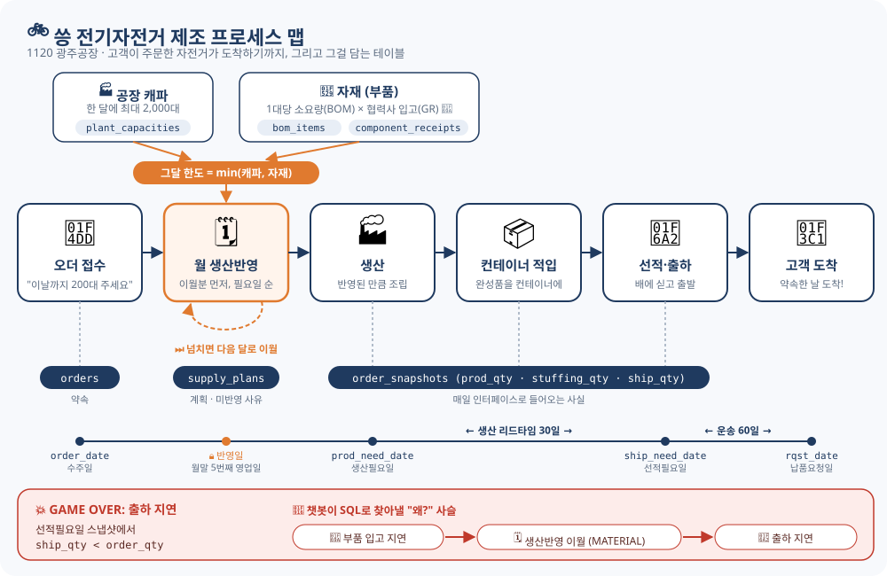
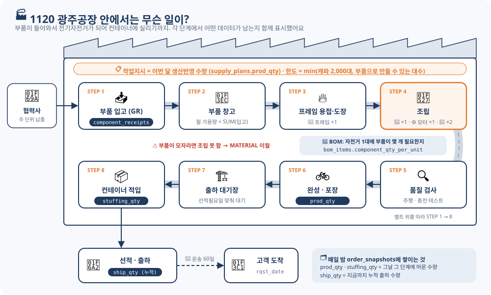
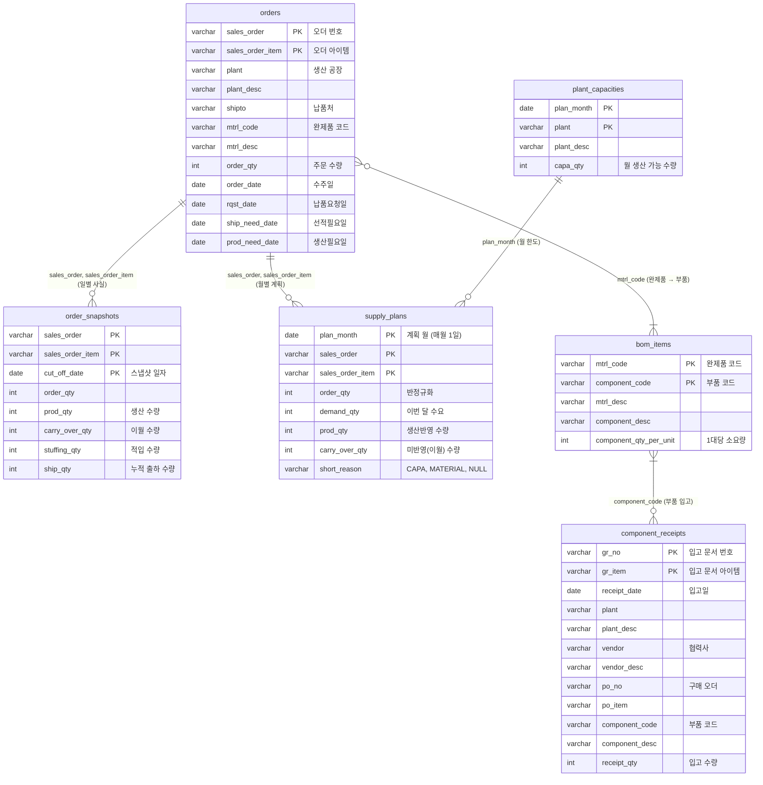

# 🚲 SCM Agent

> 제조 공급망 데이터를 스스로 조회하고 해석하는 AI 에이전트를, 프레임워크 없이 바닥부터 만들어 갑니다.
> I will be the best at SCM Programming!!

## 🎮 무대: 씅 전기자전거

이 프로젝트의 모든 데이터는 가상 기업 **씅 전기자전거**에서 일어나는 일입니다.
공장은 하나, 🏭 **1120 광주공장**. 한 달에 최대 **2,000대**를 만들 수 있어요.

전기자전거 한 대가 고객에게 도착하기까지, 아래 스테이지를 하나씩 클리어해야 합니다.



### 📝 STAGE 1. 오더 접수
고객이 "이날까지 🚲 200대 가져다주세요"라고 주문합니다.
약속한 날(**납품요청일**)에서 리드타임을 거꾸로 빼면 나머지 날짜가 정해져요.

- ⏰ 수주일(`order_date`)이 계획 마감보다 늦게 들어온 **눈치 없는 긴급 오더**도 약 10% 섞여 있어요.

### 🗓️ STAGE 2. 공급계획 (월 생산반영)
매달 말, 다음 달에 무엇을 얼마나 만들지 정하는 **생산반영** 회의가 열립니다.

- 🔒 **확정일**: 월말에서 거꾸로 세어 5번째 영업일 (주말 제외). 예) 2월 계획은 1/26에 확정
- 🚧 확정일이 지난 뒤 들어온 오더는 이번 달 계획에 못 타고 다음 달로 밀려요
- 🎯 **우선순위**: ① 지난달 이월분 → ② 생산필요일 빠른 순
- 🧱 **한도**: 공장 캐파 2,000대. 넘치는 수량은 다음 달로 **이월** (`short_reason = CAPA`)

### 🔩 STAGE 3. 자재 준비 (BOM, 부품 입고) 🛠️ 개발 중
자전거 한 대를 만들려면 부품이 있어야 해요. **BOM**(자재 명세서)이 1대당 필요한 부품 수를 알려 줍니다.

- 🚚 협력사에서 부품이 **입고(GR, Goods Receipt)** 된 기록이 입고일별로 쌓여요
- ⚖️ 그달 만들 수 있는 대수 = **min(캐파, 자재로 만들 수 있는 대수)**
  - 자재가 더 모자라면 `MATERIAL`, 캐파가 더 모자라면 `CAPA`, 똑같으면 `MATERIAL`

### 🏭 STAGE 4. 생산 → 📦 STAGE 5. 적입 → 🚢 STAGE 6. 선적·출하



생산된 자전거는 컨테이너에 **적입**되고, 배에 실려 **출하**됩니다.
이 상태는 매일 인터페이스로 들어오는 **일별 스냅샷**에 그대로 쌓여요. (🛠️ 3주차 예정)

### 💥 GAME OVER 조건: 출하 지연
**선적필요일** 시점에 누적 출하 수량이 주문 수량보다 적으면 지연입니다.

그리고 이 게임의 진짜 목표는 **"왜 늦었어?"** 에 답하는 것입니다.
(🚚 부품 입고 지연 → 🗓️ 생산반영 이월 `MATERIAL` → 🚢 출하 지연)

## 🤖 무엇을 만드나

DB를 직접 읽고, SQL로 **출하 지연의 원인 사슬**을 추적해 리포트하는 Text2SQL 챗봇입니다.

```
❓ 질문 → 🗺️ DB 구조 파악 → 🧮 SQL 생성·실행 → 🔗 원인 사슬 추적 → 📄 리포트
```

- 문서를 검색하는 RAG 챗봇과 달리, **실제 데이터를 직접 조회**해서 답합니다.
- 🌏 씅 전기자전거 전용이 아니라 **여러 제조기업 DB에 붙여 쓸 수 있는 셀프호스팅 오픈소스**를 지향합니다.
  코드 값의 뜻 같은 도메인 지식은 프롬프트에 박지 않고, 고객 DB(코드 테이블, 컬럼 설명)에서 읽게 설계합니다.

## 📜 원칙

- **프레임워크 없이**: LangChain 같은 도구 없이 Anthropic SDK의 tool use만으로 에이전트 루프를 직접 구현합니다.
- **약속 / 계획 / 사실의 분리**: 오더(약속), 공급계획(계획·판단), 일별 스냅샷(사실)을 다른 테이블에 담습니다.
- **현상은 그대로, 판단은 계산으로**: 인터페이스로 받은 데이터를 그대로 담고, "긴급 오더인가", "지연인가"는 쿼리로 꺼냅니다.
- **가짜 데이터만**: 실제 회사 데이터는 사용하지 않습니다.

## 🧰 기술 스택

Python · MySQL 8 · PyMySQL · python-dateutil · pytest · Anthropic SDK (예정)

## 🗄️ 데이터 모델

| 테이블 | 스테이지 | 설명 | 상태 |
|---|---|---|---|
| `orders` | 📝 오더 | 오더 라인당 한 행. 수주일, 납품요청일 ← 선적필요일 ← 생산필요일 | ✅ 시드 207건 |
| `plant_capacities` | 🏭 캐파 | 공장별 월 생산 가능 수량 (1120 광주공장, 월 2,000대) | ✅ 시드 41개월 |
| `supply_plans` | 🗓️ 공급계획 | 월 × 오더 라인별 수요·반영·이월 수량과 미반영 사유 (`CAPA`, `MATERIAL`) | ✅ 시뮬레이션 313행 |
| `bom_items` | 🔩 BOM | 완제품 1대당 부품 소요량 (부품 하나당 한 행) | 🛠️ 스키마만 |
| `component_receipts` | 🚚 부품 입고 | 부품 입고(GR) 문서 아이템. 일별 입고를 그대로 담음 | 🛠️ 스키마만 |
| `order_snapshots` | 📦 🚢 사실 | 매일의 생산·이월·적입·누적 출하 수량을 그대로 쌓음 | 🛠️ 3주차 |

### 🧩 ERD

아직 DB에 외래키는 걸지 않았습니다 (6주차 재논의). 아래 선은 조인에 쓰는 **논리적 관계**입니다.



공급계획 행에서는 항상 `prod_qty + carry_over_qty = demand_qty`가 성립합니다.
이월분은 다음 달 새 행의 `demand_qty`로 이어져, "언제 왜 밀렸는지"가 사슬로 남습니다.

## 📁 폴더 구조

```
├── db/
│   ├── schema.sql                     # 테이블 생성 (⚠️ 재실행 시 모든 데이터 삭제)
│   ├── verify_orders.sql              # 오더 시드 검증 쿼리
│   └── analyze_monthly_demand_qty.sql # 월별 수요 합계 분석 (캐파 값 결정용)
├── script/
│   ├── db.py                          # DB 접속 (.env)
│   ├── date_utils.py                  # month_range, plan_lock_date(생산반영일)
│   ├── seed_order_data.py             # 가짜 오더 생성
│   ├── seed_plant_capacities.py       # 공장 월별 캐파 생성
│   └── simulate_supply_plans.py       # 월별 공급계획 시뮬레이션
├── tests/                             # pytest (month_range, 생산반영일, 월 배분)
├── docs/
│   ├── PROGRESS.md                    # 진행 상황과 학습 로그
│   ├── img/                           # README 그림 (SVG)
│   └── tasks/                         # 작업 지시서
└── CLAUDE.md                          # 프로젝트 규칙과 도메인 정의
```

## ▶️ 시작하기

> Windows + Git Bash 기준입니다. 필요한 것: Python 3.12+, MySQL 8.

**1. 환경 변수**
```bash
cp .env.example .env   # DB 접속 정보와 API 키를 채운다
```

**2. 가상환경과 패키지**
```bash
python -m venv venv
source venv/Scripts/activate
pip install -r requirements.txt -r requirements-dev.txt
```

**3. 데이터베이스와 테이블**
```bash
mysql -u <username> -p -e "CREATE DATABASE IF NOT EXISTS <db_name> CHARACTER SET utf8mb4;"
mysql -u <username> -p <db_name> < db/schema.sql
```

**4. 게임 시작: 순서대로 실행**
```bash
python script/seed_order_data.py         # 📝 오더 207건
python script/seed_plant_capacities.py   # 🏭 캐파 41개월 (2024-11 ~ 2028-03)
python script/simulate_supply_plans.py   # 🗓️ 공급계획 313행
```
캐파와 공급계획은 오더의 생산필요일을 기준으로 만들어지므로 순서를 지켜야 합니다. 모든 스크립트는 멱등이라 몇 번을 다시 돌려도 결과가 같습니다.

**5. 검증**
```bash
mysql -u <username> -p --default-character-set=utf8mb4 <db_name> < db/verify_orders.sql
pytest
```
검증 쿼리는 규칙을 어긴 행만 보여줍니다. 출력이 없으면 통과입니다.
공급계획은 `SUM(prod_qty) = SUM(order_qty) = 41,400`이면 모든 수량이 빠짐없이 반영된 것입니다.

## 🗺️ 로드맵

| 마일스톤 | 날짜 | 목표 |
|---|---|---|
| 🥚 M0 | 10/16 | 출하 지연 원인 사슬을 손으로 쓴 SQL로 추적 |
| 🐣 M1 | 10/23 | 터미널 에이전트 (SQL 실행 도구 + 에이전트 루프) |
| 🐥 M2 | 11/6 | 웹 챗봇 (Vue → FastAPI) |
| 🐔 M3 | 11/27 | 원인 사슬 리포트 |
| 🏆 M4 | 12/18 | 데모 데이 |

- [x] 오더 가짜 데이터 생성과 검증
- [x] 공장 캐파, 월별 공급계획 시뮬레이션 (CAPA 이월)
- [ ] 자재 부족 시나리오 (BOM, 부품 입고, MATERIAL 이월)
- [ ] 일별 스냅샷 시뮬레이션, 지연 조회 뷰
- [ ] SQL 실행 도구와 에이전트 루프
- [ ] 평가 세트와 안전장치 (SELECT only, LIMIT)
- [ ] 웹 챗봇, 원인 사슬 리포트, 데모

진행 상황과 매일의 학습 기록은 [docs/PROGRESS.md](docs/PROGRESS.md)에 있습니다. 이슈와 PR로 매일 성장하고 있어요. 응원해 주세요! 🙌
